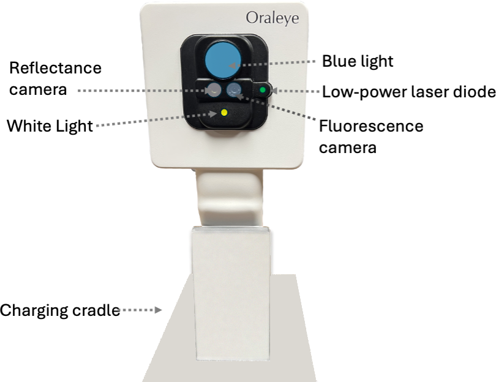

## Device Controls

The OralEye™ device is normally stored in a charging cradle. The cradle includes a port for charging the device and a stand to hold test charts that are used to make sure the device remains calibrated over time.

The device interface includes a large touchscreen display and three physical buttons located on the handle, facing the user.

| Button Location | Function Name | Primary Function in App |
|:---:|:---:|:---|
| Top | Action/Capture | Image Capture or Confirm/Continue |
| Middle | Navigation/Back | Return to Previous Screen or Cycle Options |
| Bottom | Power Button | Activate/Deactivate device power |

The Power Button activates or deactivates the device power. Upon activation, the device's internal compute module automatically launches the OralEye Application.

The user interacts with the application using the touchscreen and the two remaining physical buttons: the top button (Action Button) and the middle button (Navigation Button).

The function of the Action Button and the Navigation Button is context-dependent, based on the current screen displayed within the OralEye Application.

The Action Button is designated for primary functions, such as image capture or advancing to the next step of the documentation protocol.

The Navigation Button is designated for secondary functions, such as returning to the previous screen or cycling through display options.

::: {.callout-note}
## Context-Dependent Functions
The specific, context-dependent function for each button is detailed in the [Step-by-Step Operating Instructions](operation.qmd).
:::

---

## Device Optics and Imaging

### Patient-facing side

The patient-facing side of the device incorporates:

* Two cameras
  * reflectance camera
  * fluorescence camera
* A white light
* A blue light
* A low-power laser diode (520 nm, green light)

{fig-alt="Patient-facing side of the OralEye handpiece showing cameras, lights, and laser" width="40%"}

The **white light** and the **reflectance camera** are utilized for image preview and conventional reflectance imaging.

The **blue light** and the **fluorescence camera** are used for capturing fluorescence images.

A **low-power laser diode** (< 0.39 mW) is used to assist the user in positioning the device relative to the regional oral area. Optimal imaging distance (approximately 10 cm) is achieved when the image of the laser diode dot is centered on the display screen.

### Image Acquisition Sequence

When the user initiates image acquisition, the device captures two distinct images sequentially:

1. **Reflectance Image Acquisition:** The conventional reflectance image is captured using the white light LED and the reflectance camera.
2. **Fluorescence Image Acquisition:** Immediately following the reflectance capture, the fluorescence image is acquired using the blue light LED and the fluorescence camera. This acquisition is performed by briefly flashing the **blue light LED** (while the white light LED is deactivated) and measuring the resulting fluorescence with the dedicated **fluorescence camera**.

---

*Next: [Documentation Protocols](operation.qmd) · [Safety Information](safety.qmd)*
