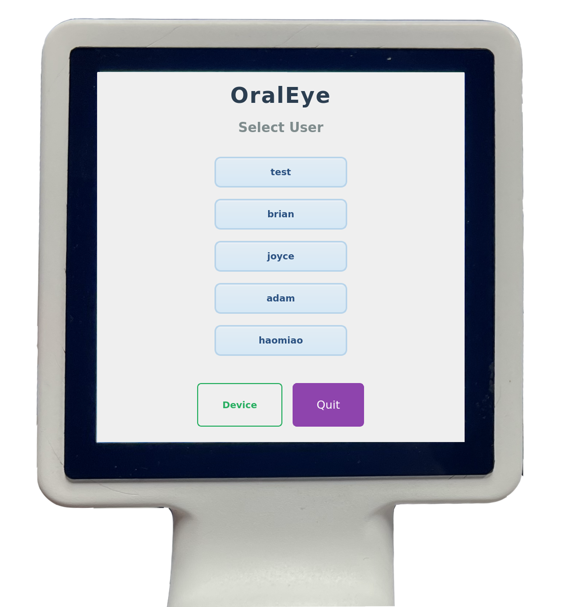
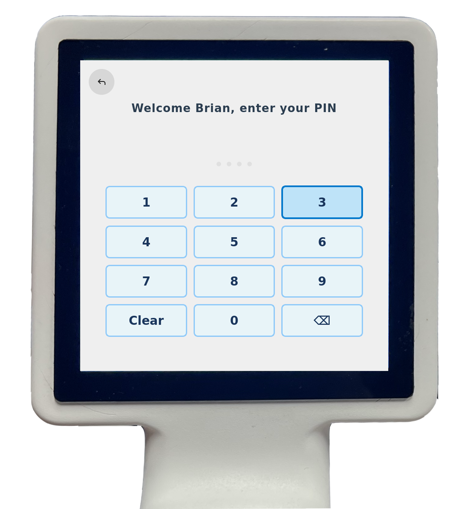
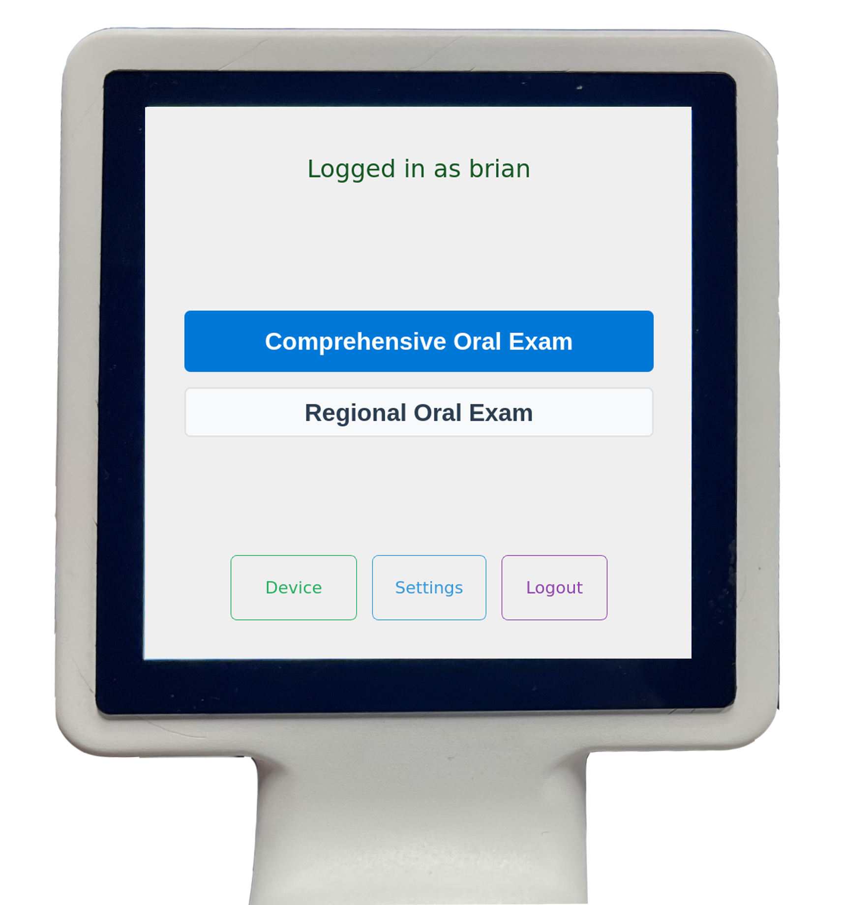
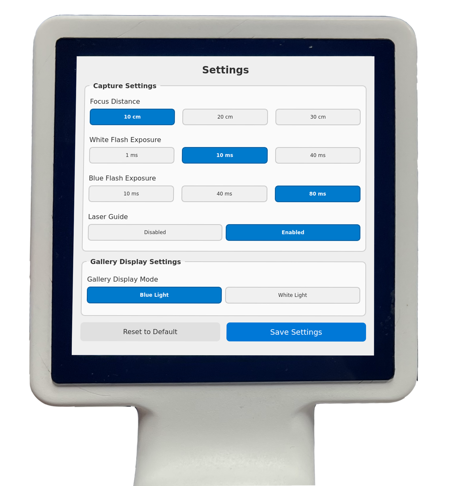
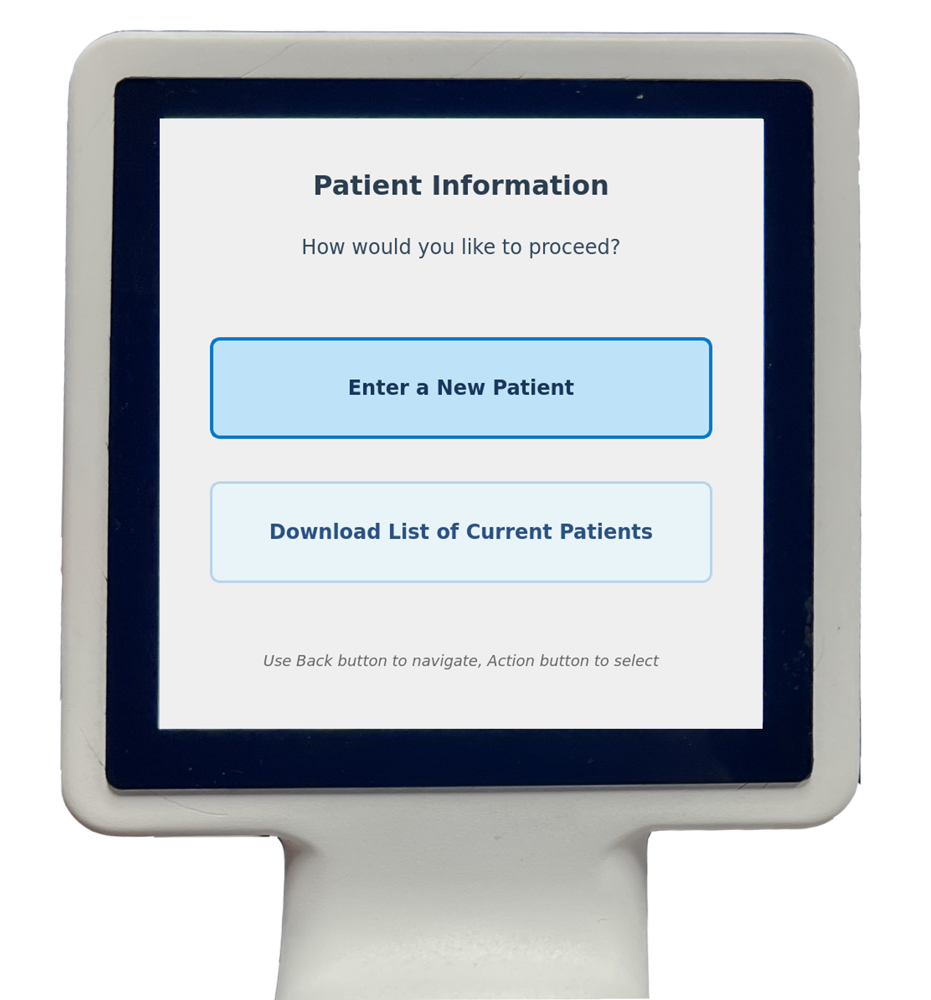
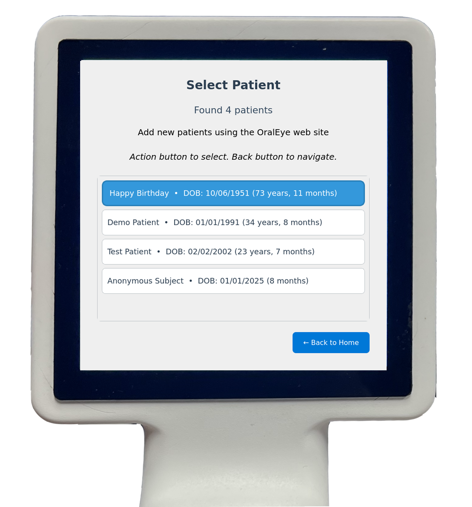
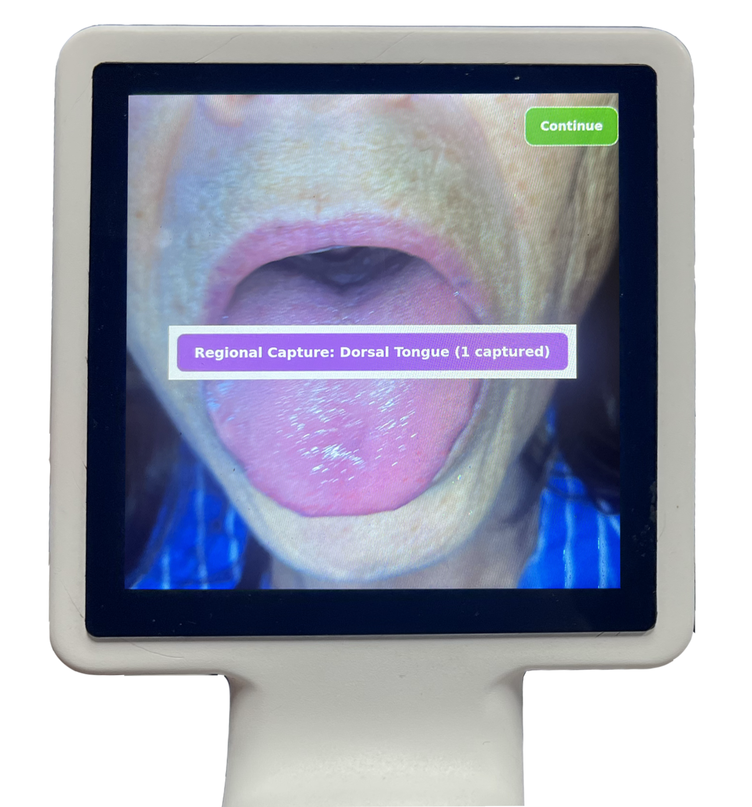
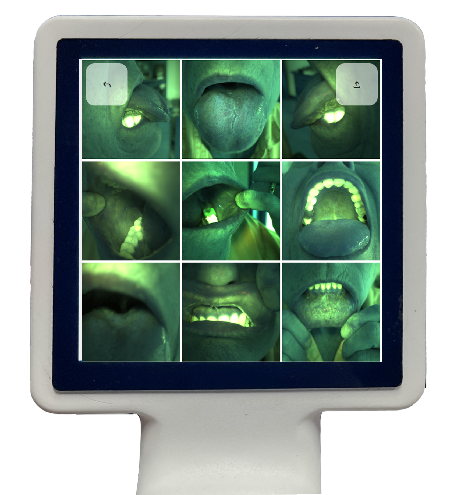
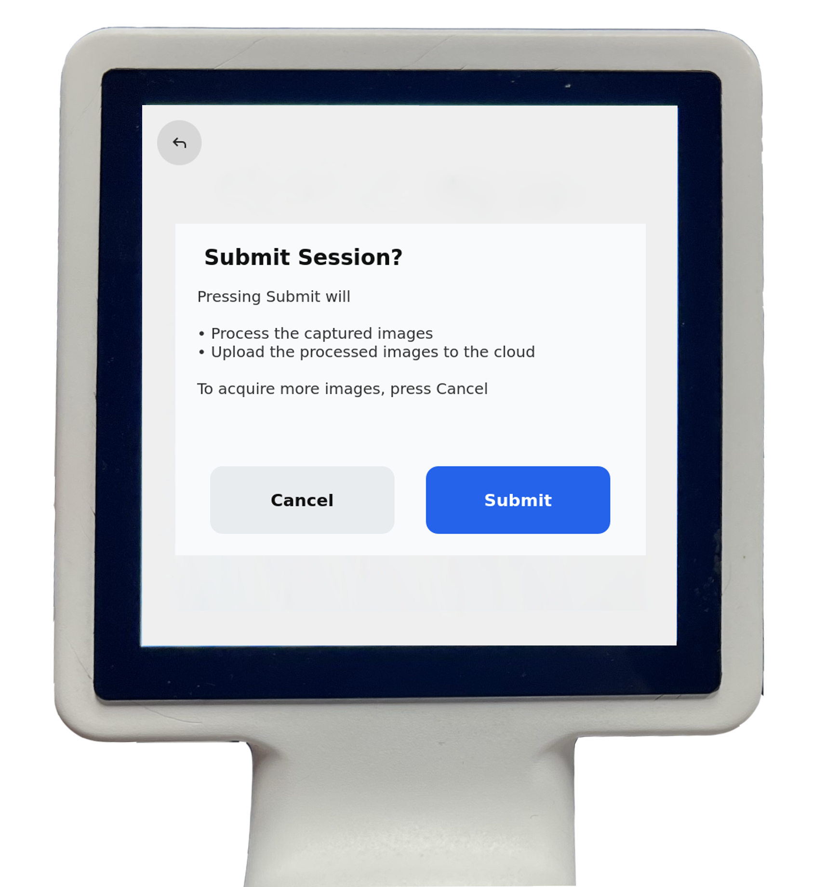
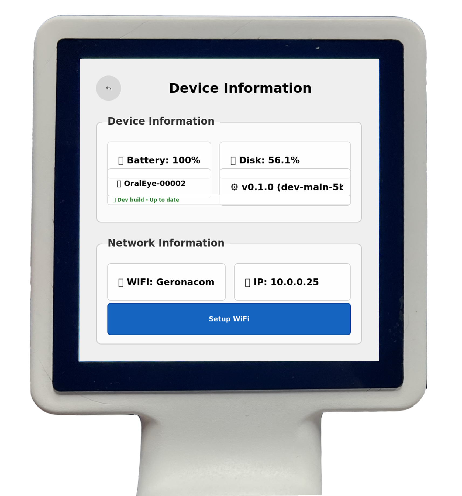

## Documentation Protocols

The OralEye™ Imaging System supports both **standardized documentation of the full oral cavity** and **regional site-specific records**.

### Comprehensive Record

The **Comprehensive Record** involves a systematic capture of the patient's oral cavity, utilizing reflectance and fluorescence imaging across key anatomical sites. This protocol is designed to establish a stable, objective baseline of the patient's oral mucosal appearance. By recording tissue patterns, this approach creates a 'visual ledger' that assists the clinician in longitudinal monitoring. Periodic documentation enables the clinician to compare current images against archived records, facilitating the tracking of visible changes over time for routine dental record-keeping and professional consultation.

### Regional Record

The **Regional Record** is intended for the standardized capture of areas with visible clinical findings. This protocol records high-contrast reflectance and fluorescence images of a specific site and includes digital tools to document the visible dimensions and shape. The resulting objective data provides a 'visual ledger' to assist the clinician in tracking changes in the appearance of a site over time. This regional record facilitates the collection of high-resolution, standardized data to support the referral handshake between general practitioners and specialists. By providing a permanent digital record, the system ensures that specialists receive a consistent and objective data set for triage and longitudinal monitoring.

---

## Step-by-Step Instructions for Use

The OralEye™ Imaging System includes disposable plastic covers that should be placed over the entire device before each **patient imaging session**. After each use, the cover should be removed and disposed of according to infection control protocols to ensure safety, hygiene, and to prevent cross-contamination between patients.

::: {.callout-important}
## Barrier Protection Required
Follow these steps prior to every **digital record capture**. When properly used, the plastic cover protects the OralEye device from contaminants and helps prevent the spread of infection to patients, while allowing adequate ventilation through built-in openings to prevent overheating.
:::

### User Access and Authentication

Once the device is powered on and the OralEye Application is launched, the user is guided through the login process. User credentials and patient information are managed centrally through the OralEye web portal. Refer to the **[Administrator Guide](admin-guide.qmd)** for setup procedures.

**Login Screen:** This screen displays a list of registered user profiles unique to this device. The user scrolls through the list and taps their name to select a profile. Only registered users (managed via the cloud-based web interface) can operate the device.

{fig-alt="OralEye login screen displaying user profile list" width="40%"}

**PIN Entry:** After user identification, the device prompts the user to enter a digital Security PIN, which is managed through the web interface. The user enters the PIN by tapping the appropriate numbers on the display screen. This completes the two-factor authentication process.

* To correct a single entry, the user can tap the **Delete Key (X)**; they can use the **Clear Key** to delete the entire entry and start again.
* To return to the Login Screen and select a different user, the user can press the **Navigation Button** or tap the return arrow at the upper left of the screen.

{fig-alt="OralEye PIN entry screen" width="40%"}

### Home Screen

After a successful login, the **Home Screen** is displayed, serving as the primary navigation hub of the OralEye Application.

The Home Screen initially presents the user with two options:

* **Comprehensive Record**
* **Regional Record**

Additionally, three informational and control buttons are located at the bottom of the screen:

1. **Device:** Displays system status information, including battery charge level, available disk space, and Wi-Fi connection status.
2. **Settings:** Allows the user to view or modify camera exposure durations and configure optional features, such as the images displayed in the gallery.
3. **Logout:** Returns to the Login screen.

{fig-alt="OralEye home screen showing Comprehensive Record and Regional Record options" width="40%"}

### Settings

Device administrators can access the device Settings page, shown here, from the Home page. This page gives the administrator access to several image capture parameters: the focus distance, exposure duration of the LED flashes, and enabling/disabling the laser guide.

The administrator can also set which camera images are displayed on the Gallery page for review by selecting "White light" for reflectance and "Blue light" for autofluorescence images.

The settings on this page are saved either via the touch screen 'Save Settings' or by pressing the Action button.

{fig-alt="OralEye settings page with capture parameters" width="40%"}

### Patient Selection and Session Initiation

1. From the Home Screen, select **Comprehensive Record** or **Regional Record**.

2. The application will display the Patient Information screen: **"How would you like to proceed?"**

3. **For a New Patient:** Tap **Enter a New Patient**. Enter the new patient number using the on-screen keypad and tap **Continue**. If this is a New Patient, the user is prompted to create a patient number. The number is entered through the touch screen. After the data are uploaded, the patient number is used to begin a new patient profile on the web-site (see [Administrator Guide](admin-guide.qmd)).

{fig-alt="OralEye new patient entry screen" width="40%"}

4. **For an Existing Patient:** Tap **Download List of Current Patients**. Scroll through the downloaded list and tap the patient's name to select them, or use the **Navigation Button** to scroll and the **Action Button** to select.

If the user indicates that the patient information has already been entered on the web-site, the list of known patients is downloaded to the app from the web. The user scrolls to select the patient from the downloaded list. The **Patient Gallery** displays a historical list of existing patient records, uniquely identified by their name and date of birth.

Only patients expected to be in the clinic on that day for that user are downloaded. The user selects a patient by tapping their name on the screen, or by navigating to a patient name using the 'Navigate' button and then selecting the patient name using the 'Action' button.

{fig-alt="OralEye patient selection screen" width="40%"}

### Initiating a Session

Either method of identifying a patient initiates a new documentation session. This action automatically creates a time-stamped folder on the OralEye where the patient's digital records will be temporarily stored.

After successfully starting a new session and identifying both the user and the patient, the application displays the **Gallery Screen**. This screen presents nine distinct capture targets for the record, including, but not limited to, the left lateral tongue, hard palate, and tonsils.

In the Comprehensive mode, the user is guided to record data from these nine different regions. In the Regional mode, the user selects one of these regions (using the touch screen) for focused documentation, and they capture as many records as necessary of that specific site.

### Image Acquisition and Review

#### Aiming and Focus

Once image acquisition is initiated (either manually or through the guided mode), the device enters the **Camera Preview Mode**. A banner at the top of the screen displays the expected anatomical location to be captured.

In the guided mode, the green, low-power laser diode (520 nm) acts as an **aiming and distance guide**. The user adjusts the position of the device to obtain a clear image of the desired anatomical location at the proper distance. This 10 cm distance is achieved when the **green laser dot** is centered on the display screen.

#### Capture

When the user is ready, they briefly press the **Action Button**. After a delay of approximately 0.5 seconds, a sequence is initiated to capture two images:

* **Reflectance Image:** Captured using the white light LED and the reflectance camera.
* **Fluorescence Image:** Captured using the blue light LED and the fluorescence camera.

The total time required for the acquisition of both images is approximately 500 milliseconds. Immediately following the acquisition sequence, either the **Reflectance Image** or the **Fluorescence Image**, a user setting, is displayed on the screen for review.

The user can accept the captured image by tapping the green **'Continue' button** on the touchscreen or by pressing the Action button.

{fig-alt="OralEye image review screen with Continue button" width="40%"}

Upon acceptance, the user is returned to the **Gallery Screen**. In the **Comprehensive** mode the newly acquired image replaces the initial icon for that anatomical location in the Gallery. The user can retake any specific image by tapping its corresponding location in the Gallery. The user is guided to acquire nine (9) images to fully populate the Gallery, although they can pause at any time.

In the **Regional** mode the user can take multiple pictures, focusing on one anatomical location. When they are ready, they use the Navigation button to return to the Regional Gallery. There, they can see all of the images they acquired, either the fluorescence or reflectance images according to a user setting.

{fig-alt="OralEye comprehensive gallery with captured images" width="40%"}

### Uploading the Documentation Session

Once the user is satisfied with the captured records for the session, they submit the data to the secure web platform.

The submission process is initiated by a **long-hold press** on the **Action Button**. This action displays a submission dialog box with the following options:

* **Cancel:** Returns the user to the **Gallery Screen**, allowing them to acquire new images or modify existing ones.
* **Submit:** Processes the captured images on the device and initiates the upload to the web portal.

{fig-alt="OralEye submit session dialog" width="40%"}

During the submission process, progress bars are displayed to indicate the status of both image processing and uploading. As part of the upload process, a **secure hash code** is generated from the raw image data. This hash code is subsequently used to verify the integrity of the data upon secure clinical storage.

After uploading, the local data are removed from the device.

### Logging Out and Powering Off

After a successful submission, the user is automatically returned to the **Home Screen**.

From the Home Screen, the user has two options to end the session:

1. **Logout:** Select the **Logout** option on the screen to return to the Login Screen.
2. **Power Off:** Press the **Power Button** (bottom button) to quit the application and deactivate the device power.

---

## Device Information

### Device screen

This section provides key details about your device's **status** and **hardware**.

* **Status Indicators:** Shows the current **Battery level** and **Disk Usage**.
* **Identification:** Displays the unique **Device ID** and the current **Software Version**.
* **Software Updates:** Indicates if the on-device application is **up-to-date** or if a **new download** is available. If an update is ready, tap the update box to begin the download.

{fig-alt="OralEye device information screen showing battery, disk usage, and software version" width="40%"}

---

### Network Information

This area shows the device's current network configuration:

* **WiFi SSID:** The name of the connected Wi-Fi network.
* **IP Address:** The device's current network address.

---

### Setting Up Wi-Fi

To connect your device to a new Wi-Fi network:

1. For new installations, touch the **Setup WiFi** button.
2. The device's camera will turn on.
3. On the main website, generate a **QR code** containing your network credentials.
4. Use the device's camera to **scan the QR code**.
5. The device will automatically sign onto the specified Wi-Fi network using the information from the QR code.

### Camera Settings

It is possible for the user to adjust certain camera settings as well, though these are usually set to their default values. The **Capture Settings** below control the camera focus distance, the duration of the several types of exposures, and the blue light intensity.

The **Gallery Display Settings** control whether the fluorescence or reflectance record is shown in the Gallery during the documentation session. The default settings are shown in the image. These settings are always included in the metadata uploaded with the session data.

---

*Next: [Troubleshooting](troubleshooting.qmd) · [Maintenance](maintenance.qmd) · [Administrator Guide](admin-guide.qmd)*
