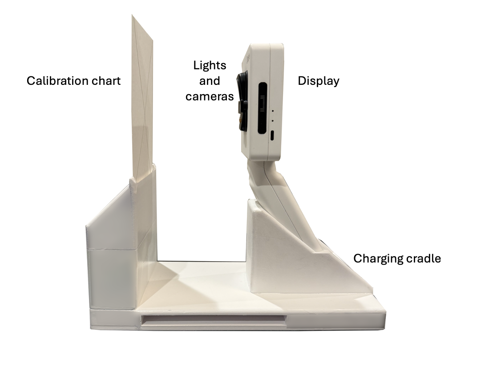

The OralEye™ Imaging System is an extraoral digital camera intended for use by dental professionals to capture, display, and store high-contrast reflectance and fluorescence images of the oral cavity. The system provides a standardized "visual ledger" for:

* **Clinical Documentation:** Creating a permanent digital record of visible oral tissues during routine dental imaging sessions.

* **Longitudinal Monitoring:** Providing repeatable, standardized images to track the appearance of visible anomalies over time.

* **Medical Communication:** Facilitating the secure transfer of encrypted digital records to specialists for professional consultation and referral (Product Code LMD).

::: {.callout-important}
## Important Note
The OralEye™ is not intended for the standalone detection of oral cancer, the diagnosis of occult pathology, or the determination of surgical margins.
:::

## System Components

The OralEye™ system includes four main components:

* **Handpiece:** a handheld imaging unit equipped with dual cameras, illumination sources, and a display.
* **Charging Cradle:** used for docking and recharging the Handpiece.
* **Calibration Chart Holder:** designed to hold various calibration charts.
* **External Power Adapter:** supplies power to the Charging Cradle.

{fig-alt="OralEye handpiece resting in its charging cradle" width="60%"}

The Handpiece is designed for use with a single-use, disposable plastic barrier to maintain hygiene and prevent cross-contamination between patients.

## Imaging

During operation, the OralEye™ Handpiece emits two types of light into the oral cavity:

1. **White illumination** to capture reflectance images of the oral mucosa.
2. **Blue excitation light** to induce tissue autofluorescence, enabling capture of fluorescence images that reveal differences in tissue characteristics.

Both image types are stored locally on the device and automatically uploaded to the secure OralEye™ Cloud Platform, where they can be integrated into patient health records.

Images may be viewed in real time during acquisition and subsequently compared across visits to monitor changes in tissue appearance. The combination of reflectance and fluorescence imaging provides complementary visual information to support the documentation of visible areas that the clinician has identified for further tracking or professional consultation.

---

*Next: [Intended Use](intended-use.qmd) · [Safety Information](safety.qmd) · [Device Description](device-description.qmd)*