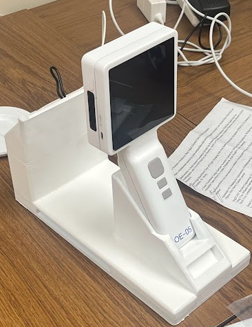

::: {.hero-section}
::: {.hero-content}
::: {.hero-text}
# OralEye Oral Imaging System

Official Instructions For Use and technical documentation for dental professionals.

::: {.hero-cta}
[Get Started](ifu/overview.qmd){.btn .btn-primary .btn-lg}
[View Safety Info](ifu/safety.qmd){.btn .btn-outline-light .btn-lg}
:::
:::

::: {.hero-image}
{fig-alt="OralEye imaging device"}
:::
:::
:::

::: {.callout-important}
## Important

This device is intended for use by trained dental professionals only. Read all instructions before use.
:::

## Documentation

::: {.card-grid}
::: {.doc-card}
### Instructions For Use
Complete operating instructions, safety information, and maintenance guidance.

[Read IFU →](ifu/index.qmd)
:::

::: {.doc-card}
### Regulatory
FDA clearance status, compliance symbols, and document version history.

[View Regulatory →](regulatory/index.qmd)
:::

::: {.doc-card}
### Tutorials
Step-by-step guides for common tasks and workflows.

[Browse Tutorials →](tutorials/index.qmd)
:::
:::

## Document Information

**Current Version:** 1.0.0 | **Last Updated:** January 2026 | **Status:** Draft

::: {.support-section}
**Need help?** Contact support@oraleye.ai or visit [oraleye.ai](https://oraleye.ai)
:::

---

*This documentation is maintained under ISO 13485:2016 Quality Management System*
